<a name="readme-top"></a>

<!-- PROJECT LOGO -->
<br />
<div align="center">
  <a href="https://github.com/YEASEUL-JANG/KubeBoard">
    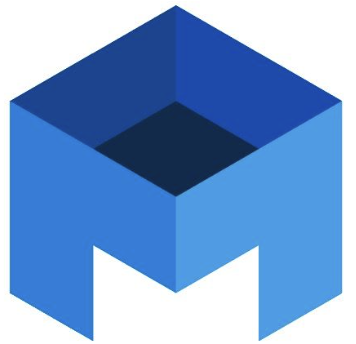
  </a>

  <h3 align="center">Kube Board</h3>

  <p align="center">
    ⚙️ k8s client APi를 통해 k8s 자원을 관리할 수 있는 웹페이지
   </p>
</div>


<!-- TABLE OF CONTENTS -->
<details>
  <summary>Table of Contents</summary>
  <ol>
    <li>
      <a href="#about-the-project">About The Project</a>
      <ul>
        <li><a href="#built-with">Built With</a></li>
      </ul>
    </li>
    <li><a href="#getting-started">Getting Started</a></li>
    <li><a href="#function">Function</a></li>
    <li><a href="#pages">Pages</a></li>
    <li><a href="#contact">Contact</a></li>
  </ol>
</details>
<p></p>


<!-- ABOUT THE PROJECT -->
## About The Project
<p>
💡 ‘KubeBoard’ 는 로컬 쿠버네티스 클러스터 환경을 UI상에서 쉽게 조회할 수 있는 K8S Dashboard 입니다.</p><p>
💡 각 서비스를 Microservices Architecture(MSA) 프로젝트로 구성하여 독립적인 단위로 개발/관리가 가능하도록 했습니다.</p><p>
💡 Kubernetes 클러스터 환경에서의 Pod, Deployment, Service 에 대한 생성/삭제/조회가 가능합니다.
</p>

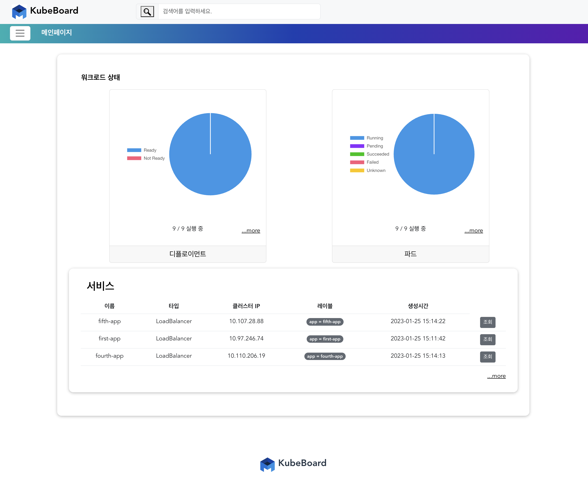
<br>
<p>
💡 ‘Pod’, 'Deployment', 'Service', 'User', 'Log' 등 다양한 도메인의 마이크로 서비스로 구성되어 각각의 독립적인 배포 및 확장이 가능합니다.
</p>

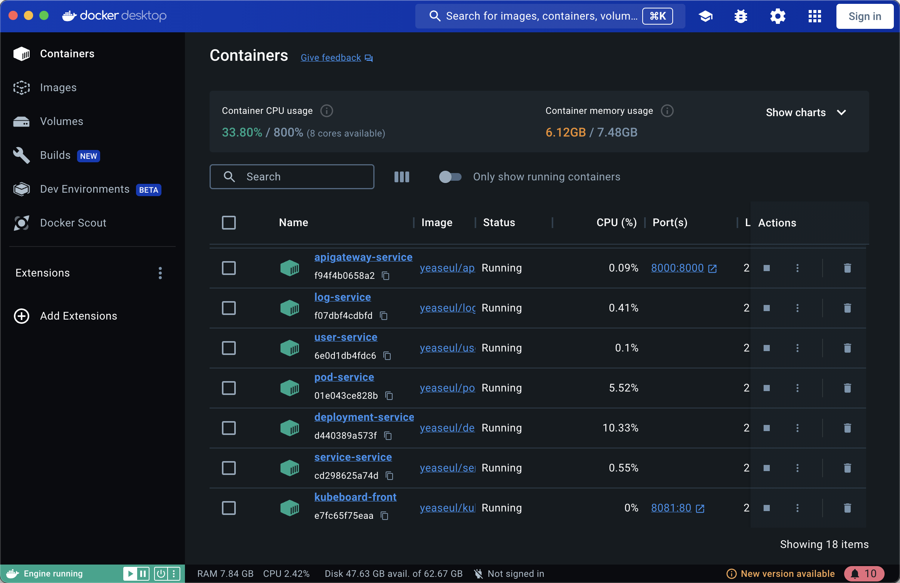
<br>
<p>
💡 조회 데이터는 30초 단위로 실시간 업데이트되며, 실제 터미널 조회DATA와 동일합니다. 
</p>
<p>
<figure>
    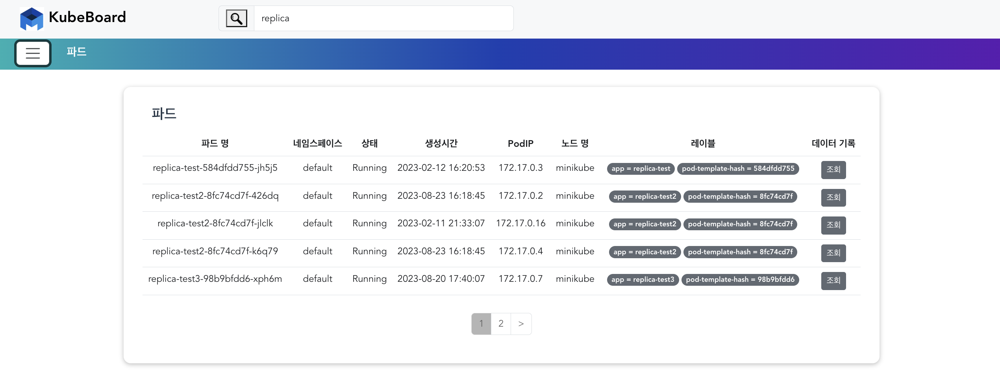
  <figcaption>[kubeboard] - Pod목록 조회</figcaption>
</figure>
</p><p>
  <figure>
   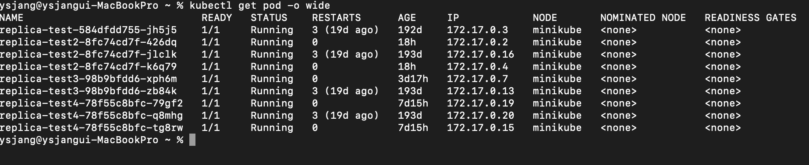  
  <figcaption>[terminal] - Pod목록 조회</figcaption>
</figure>
</p>
<p align="right">(<a href="#readme-top">back to top</a>)</p>


### Built With

사용된 frameworks,Tools 및 libraries 입니다. 

* ![SpringBoot][SpringBoot]
* ![SpringCloud][SpringCloud]
* ![Kafka][Kafka]
* ![CircuitBreaker][CircuitBreaker]
* ![Kotlin][Kotlin]
* ![JPA][JPA]
* ![Vue3][Vue3]
* ![JavaScript][JavaScript]
* ![Quartz][Quartz]
* ![Minikube][Minikube]
* ![Docker][Docker]
* ![Bootstrap][Bootstrap]

<p align="right">(<a href="#readme-top">back to top</a>)</p>


<!-- GETTING STARTED -->
## Getting Started

0. Minikube Start
   ```sh
   minikube start
   ```
1. Clone the repo
   ```sh
   git clone https://github.com/YEASEUL-JANG/KubeBoard.git
   ```
2. Move to Frontend Folder
   ```sh
   cd frontend
   ```   
3. Install NPM packages
   ```sh
   npm install
   ```
4. Run a application and vue3 page 
   ```sh
   npm run serve
   ```

<p align="right">(<a href="#readme-top">back to top</a>)</p>


<!-- Function -->
## Function

- [x] k8s fabric client API를 활용한 k8s 데이터 조회/생성/삭제/스케일링 기능
- [x] 사용자 활동기록을 위한 실시간 log 데이터 축적
- [x] Quartz Batch 로 30초 간격 k8s 데이터 동기화 
- [x] DB 구조 설계 (JPA)
- [x] QuaryDSL을 활용한 다중 검색기능
- [x] SpringConfig 를 통한 서비스 구성정보 중앙 별도 관리
- [x] Kafka를 통한 메시지 기반 비동기 통신
- [x] Circuit Breaker를 활용한 장애발생 예방
- [x] Docker Image 빌드를 통한 각 마이크로서비스 도커 배포 

<p align="right">(<a href="#readme-top">back to top</a>)</p>


<!-- Pages -->
## Pages


### MainPage
<figure>
    
  <figcaption>파드와 디플로이먼트의 현재 실행상태를 차트화, 서비스 데이터를 테이블로 나타냄</figcaption>
</figure>


### ListPage
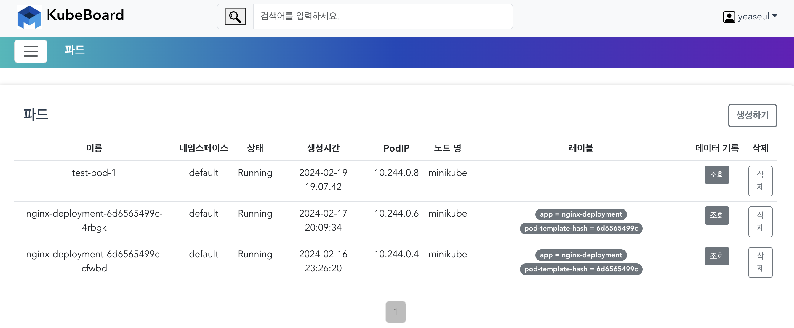
  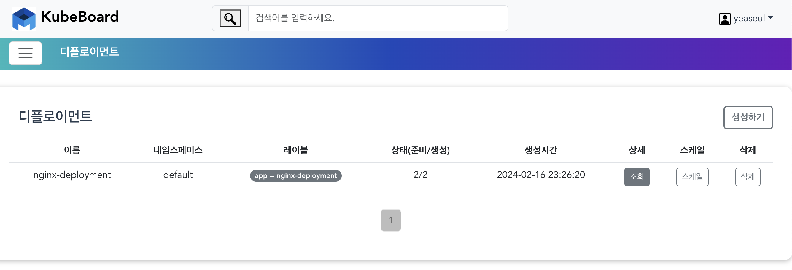
  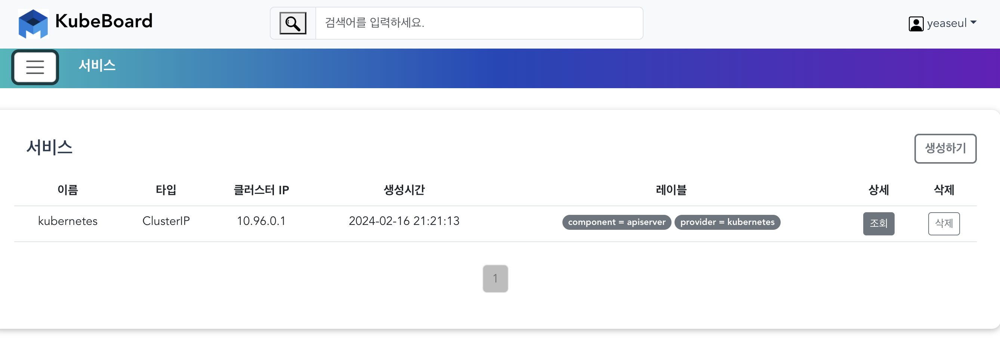


### DetailListPage
<figure>
    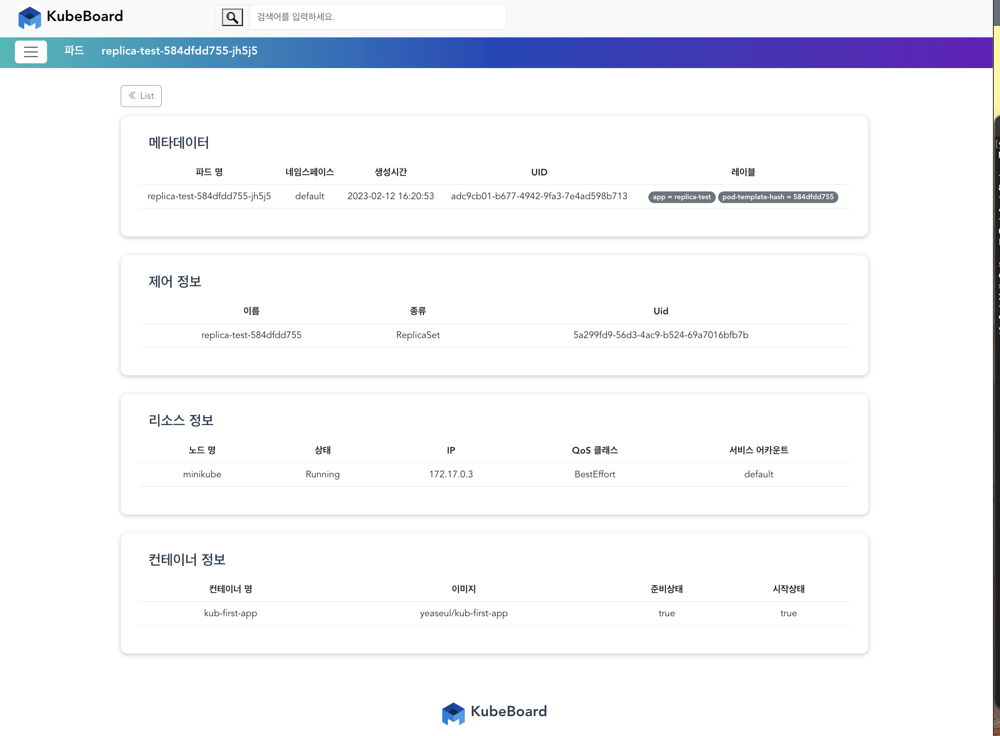
  <figcaption>상세페이지 예시</figcaption>
</figure>


### MYPAGE
<figure>
    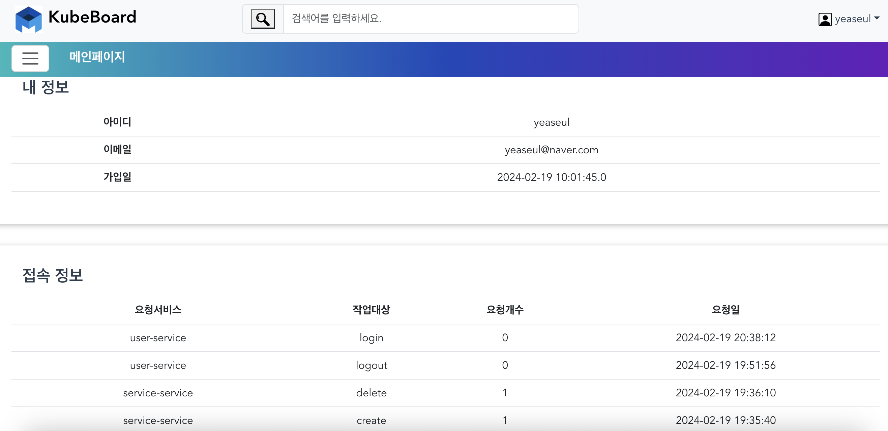
  <figcaption>개인 정보 및 활동기록</figcaption>
</figure>


### CreateModal
<figure>
    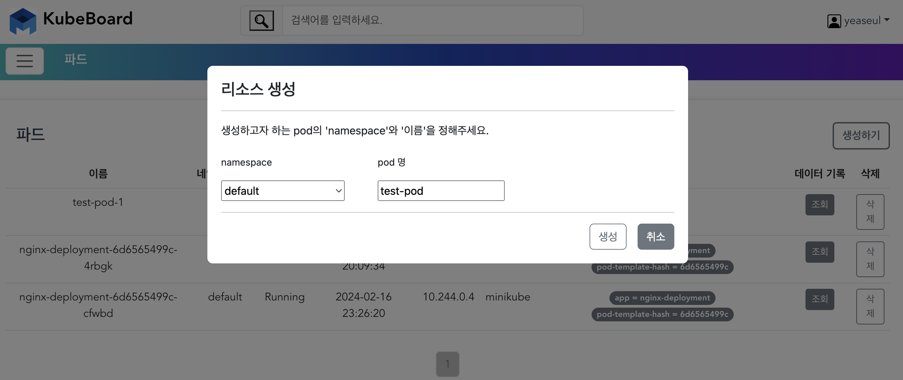
  <figcaption>파드 생성</figcaption>
</figure>
<figure>
    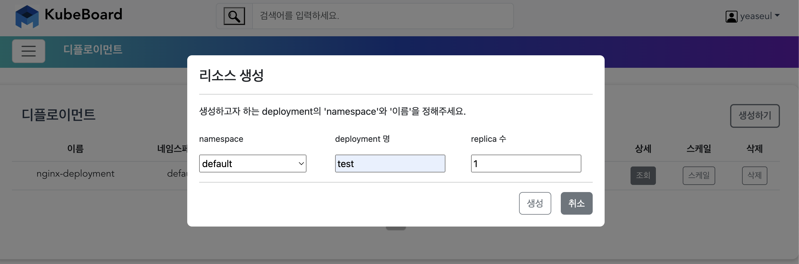
  <figcaption>디플로이먼트 생성</figcaption>
</figure>
<figure>
    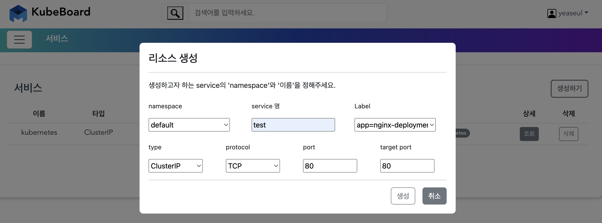
  <figcaption>서비스 생성</figcaption>
</figure>


### Replica Scailing Modal
<figure>
    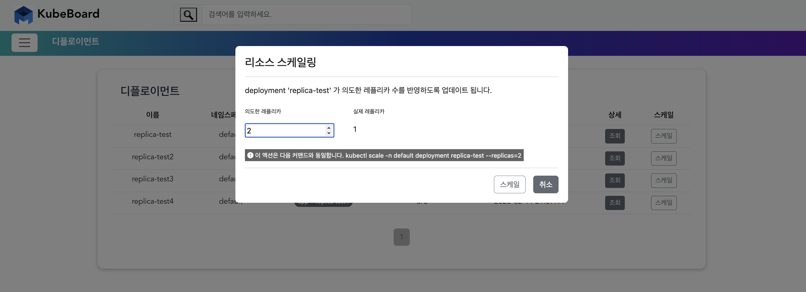
  <figcaption>생성/스케일 시 페이지가 3초단위로 reroad 되면서 실시간 업데이트 내용이 반영됨.</figcaption>
</figure>
    

<p align="right">(<a href="#readme-top">back to top</a>)</p>


<!-- CONTACT -->
## Contact

- YouTube Link: [https://youtu.be/OW03DGPwbpw?si=2mGGHfPDOLGARDhy](https://youtu.be/OW03DGPwbpw?si=2mGGHfPDOLGARDhy) 
- Project Link: [https://github.com/YEASEUL-JANG/KubeBoard](https://github.com/YEASEUL-JANG/KubeBoard)

<p align="right">(<a href="#readme-top">back to top</a>)</p>


<!-- MARKDOWN LINKS & IMAGES -->
[Vue3]: https://img.shields.io/badge/Vue3-20B2AA?style=for-the-badge
[SpringBoot]: https://img.shields.io/badge/SpringBoot-green?style=for-the-badge
[Kotlin]: https://img.shields.io/badge/Kotlin-orange?style=for-the-badge
[rabbitMQ]: https://img.shields.io/badge/rabbitMQ-pink?style=for-the-badge
[JPA]: https://img.shields.io/badge/JPA-red?style=for-the-badge
[Kafka]: https://img.shields.io/badge/Kafka-blue?style=for-the-badge
[Minikube]: https://img.shields.io/badge/Minikube-blue?style=for-the-badge
[Docker]: https://img.shields.io/badge/Docker-Docker?style=for-the-badge
[JavaScript]: https://img.shields.io/badge/JavaScript-yellow?style=for-the-badge
[Quartz]: https://img.shields.io/badge/Quartz-000000?style=for-the-badge
[Bootstrap]: https://img.shields.io/badge/Bootstrap-purple?style=for-the-badge
[SpringConfig]: https://img.shields.io/badge/SpringConfig-green?style=for-the-badge
[SpringCloud]: https://img.shields.io/badge/SpringCloud-green?style=for-the-badge 
[CircuitBreaker]: https://img.shields.io/badge/CircuitBreaker-orange?style=for-the-badge
[Prometheus]: https://img.shields.io/badge/Prometheus-sky?style=for-the-badge
[Grafana]: https://img.shields.io/badge/Grafana-brown?style=for-the-badge
